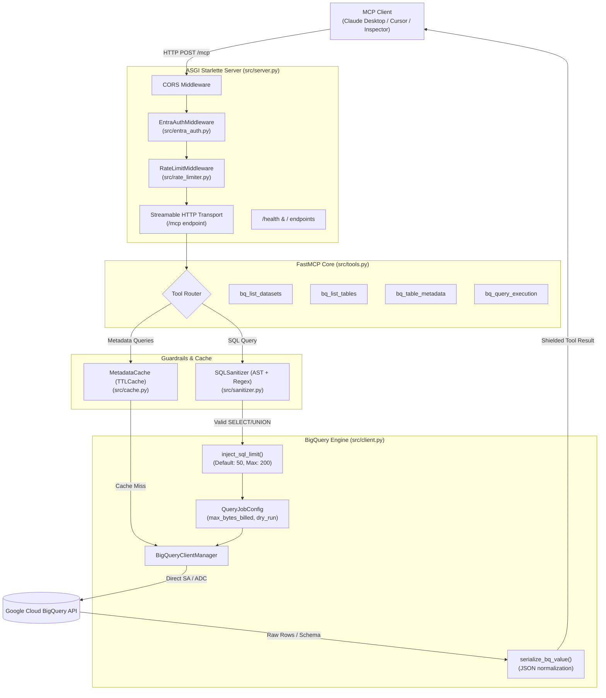

# GCP BigQuery MCP Server — Codebase Architecture & File Guide

This document provides a comprehensive reference of every file and component in this repository, with deep-dive technical explanations of each module inside `src/` and its role in the end-to-end request lifecycle.

---

## 1. System Architecture & Request Lifecycle

---

## 2. Deep-Dive: `src/` Modules

### 2.1. `src/server.py` — ASGI Application & HTTP Middleware Stack
- **Purpose**: Creates and configures the production ASGI Starlette application hosting FastMCP over the Streamable HTTP transport.
- **Key Components**:
  - `EntraAuthMiddleware(BaseHTTPMiddleware)`:
    - Bypasses authentication for `/`, `/health`, `/healthz`, and HTTP `OPTIONS` preflight requests.
    - If `security.enable_auth: false` (development mode), injects a mock user context into `request.state.user`.
    - If `security.enable_auth: true`, extracts `Authorization: Bearer <token>` from incoming HTTP headers and delegates validation to `EntraTokenValidator`.
    - Formats failures into standardized JSON responses (`401 Unauthorized` or `403 Forbidden`).
  - `create_app(settings, validator, rate_limiter) -> Starlette`:
    - Application factory that binds FastMCP’s HTTP app to the configured path (default `/mcp`) using `transport="streamable-http"`.
    - Assembles middleware in onion order: `CORSMiddleware` → `EntraAuthMiddleware` → `RateLimitMiddleware`.
    - Mounts an informational landing page on `GET /` with links to documentation and endpoint status.
  - `main()`:
    - Direct entrypoint for starting Uvicorn programmatically.

---

### 2.2. `src/tools.py` — Dynamic FastMCP Tool Registry & Error Shielding
- **Purpose**: Defines the 4 public MCP tools exposed to AI models and coordinates error masking to prevent security leaks.
- **Key Components**:
  - `_sanitize_message(raw: str) -> str`:
    - Regex engine that scrubs Google Cloud internal REST endpoints (`https://bigquery.googleapis.com/...`), local credential filesystem paths, internal Job IDs, and server stack traces from error messages.
  - `handle_tool_error(tool_name: str, exc: Exception) -> ToolError`:
    - Central exception translator.
    - Maps `google.api_core.exceptions.NotFound` to user-friendly "BigQuery resource not found" messages.
    - Maps `Forbidden` to "BigQuery access denied" messages (protecting internal IAM policies).
    - Prevents sensitive credential parsing errors from being exposed to the AI client.
  - `build_mcp_server(settings, bq_manager) -> FastMCP`:
    - Config-driven tool registrar. Conditionally enables tools according to `config.tools` settings:
      1. **`bq_list_datasets`**: Lists available BigQuery datasets in the target GCP project using free REST API. (Cached with TTLCache).
      2. **`bq_list_tables`**: Lists all tables, views, and materialized views inside a dataset using free REST API. (Cached with TTLCache).
      3. **`bq_table_metadata`**: Retrieves schema (column types, modes, descriptions), row count, byte size, partitioning, and clustering keys via free REST API. (Cached with TTLCache).
      4. **`bq_query_execution`**: Executes strictly read-only SQL with pagination, cost ceilings, job label injection (`bq_mcp_ext`), and optional `dry_run` cost estimation. Restricts direct `INFORMATION_SCHEMA` queries to protect against unnecessary scanning costs.

---

### 2.3. `src/client.py` — BigQuery Backend Client & Guardrails Engine
- **Purpose**: Directly interfaces with Google Cloud BigQuery, enforcing cost limits, request tag injection, SQL limit injection, free REST metadata retrieval, and JSON data type serialization.
- **Key Components**:
  - `BigQueryClientManager`:
    - Thread-safe lazy-initialization of `google.cloud.bigquery.Client`.
    - Resolves credentials hierarchically:
      1. Explicit path in `config.yaml` / `settings.auth.service_account_key_path` (e.g., `gcp-phoenix-dev.json`).
      2. `GOOGLE_APPLICATION_CREDENTIALS` environment variable.
      3. Google Application Default Credentials (ADC) / Workload Identity Federation (for Cloud Run, GKE, Compute Engine).
    - **BigQuery Request Tags**:
      - `build_job_labels(request_context, request_tag) -> Dict[str, str]`:
        - Injects configurable job labels into `QueryJobConfig.labels` from `config.yaml` and request context.
        - Manages request tag name via `config.request_tag_name` (default: `'bq_mcp_ext'`).
        - Sanitizes keys and values to strictly satisfy GCP BigQuery requirements (`[a-z0-9_-]`, max 63 characters).
    - **Zero-Cost Metadata Engine**:
      - `list_datasets()`, `list_tables()`, `get_table_metadata()`: Exclusively uses 100% free BigQuery REST APIs ($0.00 / 0 query bytes).
    - `execute_query(query, dry_run, limit, request_context, request_tag)`:
      - Validates query against `SANITIZER` (enforcing read-only operations and restricting `INFORMATION_SCHEMA`).
      - Resolves effective row limit based on hierarchy: explicit tool argument `limit` → query's `LIMIT` clause → `default_rows_returned` (capped at `max_rows_returned`).
      - Injects top-level `LIMIT <n>` server-side for live queries missing a limit to protect TB-scale tables from full-table materialization.
      - Sets `QueryJobConfig(maximum_bytes_billed=..., dry_run=..., use_query_cache=True, labels=effective_labels)`.
      - Collects execution metrics (duration in ms, bytes billed, bytes processed, cache hit flag, applied job labels).
  - `inject_sql_limit(query: str, limit_val: int) -> str`:
    - Uses `sqlglot` to parse BigQuery AST and append a `LIMIT <n>` clause safely to single-statement SELECT / UNION queries without corrupting comments or CTEs.
  - `extract_sql_limit(query: str) -> Optional[int]`:
    - Uses `sqlglot` AST parsing to read existing top-level `LIMIT` values.
  - `serialize_bq_value(val: Any) -> Any`:
    - Recursively converts BigQuery data types into JSON-serializable primitives:
      - `datetime.datetime`, `datetime.date`, `datetime.time` → ISO-8601 strings.
      - `decimal.Decimal` (NUMERIC/BIGNUMERIC) → `float`.
      - `bytes` → Base64 encoded UTF-8 strings.
      - `dict`, `list`, `set`, `tuple` → Recursively normalized collections.
  - `schema_field_to_dict(field: SchemaField) -> Dict`:
    - Recursively formats BigQuery table schemas into nested dictionaries.

---

### 2.4. `src/sanitizer.py` — Read-Only SQL Sanitizer & Guardrails
- **Purpose**: Guarantees zero write, update, or DDL operations on BigQuery via layered AST and keyword validation, and restricts expensive direct `INFORMATION_SCHEMA` scans.
- **Key Components**:
  - `SQLSanitizer`:
    - Supports three operational modes: `"regex"`, `"ast"`, and `"both"` (default).
    - `_validate_regex()`:
      - Enforces `restrict_information_schema: true` by blocking queries containing `\bINFORMATION_SCHEMA\b` and instructing callers to use free REST API metadata tools (`bq_list_datasets`, `bq_list_tables`, `bq_table_metadata`).
      - Scans query text against configured forbidden keywords (`INSERT`, `UPDATE`, `DELETE`, `DROP`, `ALTER`, `TRUNCATE`, `CREATE`, `MERGE`, `GRANT`, `REVOKE`, `EXECUTE`, `CALL`) with case-insensitive word-boundary matching (`\b`).
    - `_validate_ast()`:
      - Parses SQL using `sqlglot` under the `bigquery` dialect.
      - Enforces that multi-statement queries (e.g., `SELECT 1; DROP TABLE users;`) are blocked to prevent query chaining.
      - Enforces that the root AST expression is strictly a `Select` or `Union` query.
      - Inspects all AST table references (`root.find_all(exp.Table)`) to block any queries attempting to access `INFORMATION_SCHEMA`.
      - Recursively traverses AST nodes (`root.find_all(...)`) to verify no mutation or DDL statements exist anywhere in the syntax tree.

---

### 2.5. `src/entra_auth.py` — Microsoft Entra ID (Azure AD) Inbound JWT Validation
- **Purpose**: Authenticates AI callers and enterprise clients before allowing access to the MCP endpoint.
- **Key Components**:
  - `EntraTokenValidator`:
    - Integrates with `jwt.PyJWKClient` to retrieve and cache Microsoft's public RSA signing keys from Entra's Discovery endpoint (`https://login.microsoftonline.com/{tenant_id}/discovery/v2.0/keys`).
    - Validates signature using `RS256` only.
    - Validates accepted token issuers (supports both Azure v1.0 and v2.0 endpoints).
    - Validates audience claims (`aud` matches `client_id` or `api://{client_id}`).
    - Validates expiration (`exp`) and token lifecycle.
  - `extract_identity(claims: Dict) -> str`:
    - Extracts authenticated principal identifier prioritizing `upn` → `preferred_username` → `email` → `unique_name` → `sub` → `oid`.

---

### 2.6. `src/rate_limiter.py` — Sliding-Window Rate Limiting Engine
- **Purpose**: Protects the server and Google Cloud quotas from denial-of-service or runaway client loops.
- **Key Components**:
  - `RateLimiter`:
    - Thread-safe, sliding-window log rate limiter with microsecond timestamp tracking.
    - Evicts expired timestamps older than the sliding window (default 60 seconds).
    - Performs periodic stale-client eviction to prevent memory leaks in high-cardinality environments.
  - `RateLimitMiddleware(BaseHTTPMiddleware)`:
    - Derives client identity:
      1. Authenticated Entra ID user principal (`request.state.user["identity"]`).
      2. Reverse proxy header `X-Forwarded-For`.
      3. Direct socket IP (`request.client.host`).
    - Emits HTTP `429 Too Many Requests` when threshold is reached, with RFC-compliant `Retry-After`, `X-RateLimit-Limit`, `X-RateLimit-Remaining`, and `X-RateLimit-Reset` headers.

---

### 2.7. `src/cache.py` — In-Memory Metadata Caching Engine
- **Purpose**: Dramatically reduces BigQuery API latency and costs by caching dataset and table metadata.
- **Key Components**:
  - `MetadataCache`:
    - Thread-safe wrapper around `cachetools.TTLCache` (default 15-minute TTL, up to 1,024 entries).
    - `generate_key(prefix, *args, **kwargs)`: Produces deterministic SHA-256 digests over prefix and sorted argument payloads.
    - `_CACHE_MISS`: Sentinel object distinguishing genuine cache misses from functions that intentionally return `None`.
  - `@cached(prefix, cache_instance)`:
    - Universal decorator supporting both synchronous and asynchronous functions.

---

### 2.8. `src/__init__.py`
- **Purpose**: Standard Python package marker exposing version metadata (`__version__ = "1.0.0"`).

---

## 3. Configuration & Root Support Files

| File | Purpose |
| :--- | :--- |
| **`run.py`** | Primary application entrypoint and CLI launcher. Parses `--host`, `--port`, `--reload`, `--log-level`, and custom `--config` flags, displays a startup banner with active security configurations, and starts Uvicorn. |
| **`config/config.yaml`** | Declarative configuration file for server settings, Entra ID SSO, service account paths, BigQuery cost limits, SQL sanitizer rules, tool enablement, and caching TTLs. |
| **`config/settings.py`** | Pydantic v2 configuration engine. Parses `config.yaml` with hierarchical environment variable overrides (`.env`), validating bounds (e.g. `default_rows_returned <= max_rows_returned`). |
| **`config/__init__.py`** | Package marker for the configuration module. |
| **`gcp-phoenix-dev.json`** | Google Cloud Service Account credentials JSON key providing direct backend authentication to the active BigQuery project (`gcp-phoenix-dev`). |
| **`Dockerfile`** | Hardened non-root production container specification (`python:3.12-slim`, unprivileged user `10001:10001`, built-in `/health` healthcheck). |
| **`requirements.txt`** | Production dependencies manifest (`fastmcp`, `google-cloud-bigquery`, `pyjwt[crypto]`, `sqlglot`, `pydantic`, `uvicorn`, `starlette`, `cachetools`). |
| **`requirements-dev.txt`** | Developer dependencies for testing (`pytest`, `pytest-asyncio`, `httpx`). |
| **`.env.example`** | Documentation template listing all supported environment variables for secrets and runtime overrides. |
| **`.gitignore`** | Excludes OS metadata (`.DS_Store`), bytecode (`__pycache__`), virtual environments (`.venv/`), and credential files (`*.json`) from version control. |
| **`README.md`** | Comprehensive user-facing documentation covering setup, client configuration (Claude Desktop, Cursor, MCP Inspector), security architecture, and operational runbooks. |
